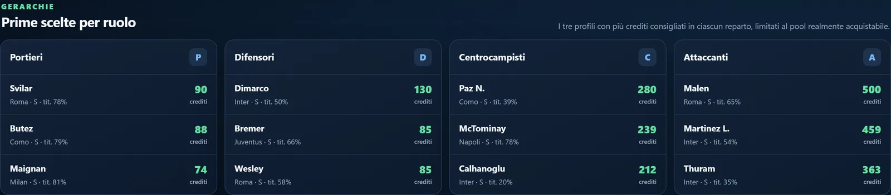
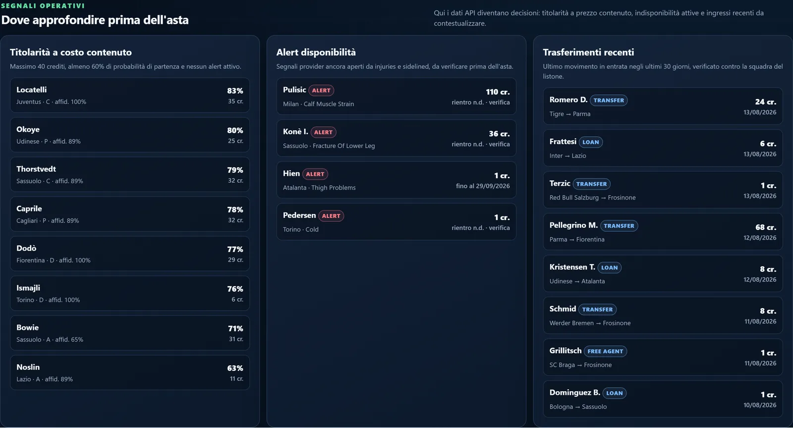
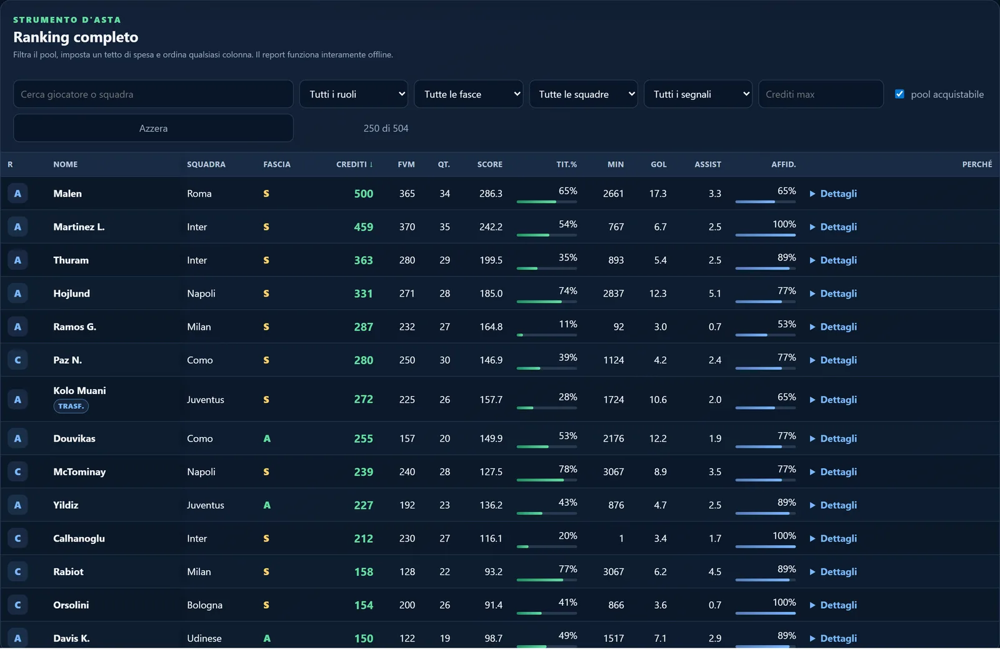
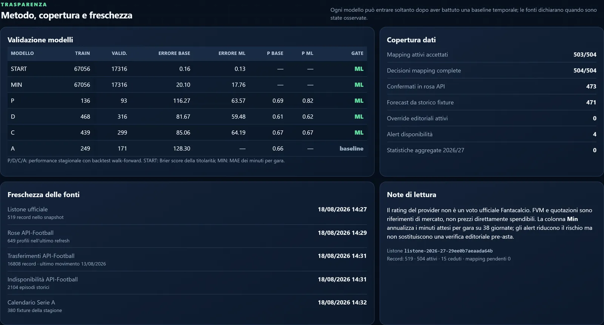

# Fantabuddy

Preparo l'asta del Fantacalcio con i dati invece che con le sensazioni. Scarichi il
listone ufficiale, lanci un comando e ti ritrovi un report HTML da aprire al tavolo
dell'asta: prezzi consigliati, probabili titolari, alert infortuni. Funziona offline,
perché al tavolo dell'asta il wifi è sempre una leggenda.

È un progetto per hobby, nato per la mia lega — 10 squadre, 1000 crediti, rose
3P/8D/8C/6A — ma sono tutti numeri che si cambiano in `config/league.default.yaml`.

📖 La storia per esteso: [Ho costruito un modello per il Fantacalcio](https://andreabozzo.github.io/AndreaBozzo/blog/posts/fantabuddy-blog/) ·
[English version](https://andreabozzo.github.io/AndreaBozzo/blog/en/posts/fantabuddy-blog/)

*English readers: this README and the code comments are in Italian, like the league they
were built for — the [write-up](https://andreabozzo.github.io/AndreaBozzo/blog/en/posts/fantabuddy-blog/)
covers the whole project in English.*


## Cosa ti ritrovi in mano

**Un prezzo per ogni giocatore che puoi davvero comprare.** Dieci rose da venticinque
slot fanno 250 giocatori, e i 10.000 crediti della lega vengono distribuiti fino
all'ultimo credito. Tutti gli altri restano in fascia E a 1 credito: il modello continua
a ordinarli, il budget non li vede.



**I segnali da guardare prima di sedersi al tavolo.** Titolari probabili sotto i 40
crediti, infortuni ancora aperti da verificare, trasferimenti dell'ultimo mese e cosa è
cambiato rispetto al listone precedente.



**Un ranking che puoi filtrare mentre l'asta va avanti.** Cerchi un nome, imposti un
tetto di spesa, ordini per qualsiasi colonna. È tutto dentro un unico file HTML: niente
server, niente internet, niente notebook aperto a metà.



## Come si usa

Servono Python 3.12, [uv](https://docs.astral.sh/uv/) e il listone ufficiale già
scaricato (`Quotazioni_Fantacalcio_Stagione_*.xlsx`).

```powershell
uv sync --all-groups
uv run fantabuddy run `
  --listoni-dir "$env:USERPROFILE\Downloads" `
  --season "2026/27" `
  --as-of "2026-08-18" `
  --kind preseason
```

Il report finisce in `outputs/<build-id>/report.html`. Aprilo col browser e sei a posto.

Per collegare anche lo storico di API-Football — rose, minuti, infortuni, partite — serve
una chiave del provider: la sezione **Setup completo** qui sotto spiega tutto.

## Di cosa fidarsi, e di cosa no

In fondo al report c'è tutto quello che serve per non fidarsi a scatola chiusa: quali
modelli sono stati ammessi, quanta copertura c'è sui dati e quando ogni fonte è stata
osservata.



Tre avvertenze che contano più di qualsiasi numero:

- **il rating è quello del provider, non il voto ufficiale del Fantacalcio**: tutto
  quello che stimo è un'approssimazione di quello che la tua lega assegna davvero;
- **gli infortuni sono alert da verificare**, non cartelle cliniche: a volte il provider
  non ha l'episodio, a volte ne ha uno vecchio;
- **FVM e quotazioni sono riferimenti di mercato**, non prezzi già spendibili.

Nessun modello entra nel report se non batte una baseline semplice. Titolarità e minuti
devono migliorarla di almeno l'1% sull'ultima stagione conclusa, tenuta fuori
dall'addestramento; il punteggio stagionale di almeno il 3% in un backtest walk-forward.
Quando non ce la fanno — quest'anno gli attaccanti — nel report entra la baseline, e va
benissimo così.

## Come nascono i prezzi

Dentro un ruolo i soldi non seguono lo score: seguono la distanza tra il giocatore e il
primo che resta fuori da tutte le rose. Poi c'è un tetto per ruolo (90 ai portieri, 130
ai difensori, 280 ai centrocampisti, 500 agli attaccanti) e una divisione del budget per
reparto: 48% attacco, 28% centrocampo, 16% difesa, 8% porta.

Quel 48% non è una verità rivelata, è una scommessa su come si comporta la mia lega
all'asta. Se nella tua i portieri volano a 100 crediti, cambia il numero in
`config/league.default.yaml`: il report si riallinea da solo e la build fallisce se i
conti non tornano esattamente a 10.000.

<details>
<summary><b>Cosa produce, nel dettaglio</b></summary>

### Cosa produce

- warehouse DuckDB con storico dei listoni e statistiche API-Football;
- storico granulare per fixture con eventi, formazioni, statistiche squadra e giocatore;
- snapshot immutabili pre-campionato e settembre;
- baseline spiegabile e modello ML soggetto a validazione temporale;
- prezzi consigliati che riconciliano esattamente i 10.000 crediti della lega;
- `ranking.csv`, `ranking.parquet`, `diff.csv`, `manifest.json` e report HTML autonomo.

I file Excel e i payload del provider sono dati privati e non vengono versionati.

</details>

<details>
<summary><b>Setup completo: API-Football, backfill e cache</b></summary>

### API-Football e backfill Pro

La chiave non deve comparire in file o comandi versionati. In PowerShell 7 può essere
impostata con input mascherato:

```powershell
$env:API_FOOTBALL_KEY = Read-Host "API-Football key" -MaskInput
uv run fantabuddy provider-check
```

È supportato anche un file `.env` ignorato da Git con
`API_FOOTBALL_KEY=...`. In alternativa, creare manualmente il file ignorato da Git
`data/private/api-football.key` con la sola chiave su una riga. Il file non viene mai
letto nei log né incluso negli artifact. Un percorso diverso può essere indicato tramite
`API_FOOTBALL_KEY_FILE`.

Il client:

- interroga `status` prima di consumare quota;
- usa una cache gzip deterministica per endpoint e parametri;
- applica il rate limit del piano e lascia una riserva giornaliera configurabile;
- interrompe con exit code 75 prima di intaccare la riserva;
- può essere rilanciato il giorno seguente e riprende dalle pagine in cache.

Acquisire le stagioni di Serie A e poi la carriera quinquennale multi-campionato,
senza `--refresh`:

```powershell
uv run fantabuddy ingest-api --seasons "2022,2023"
uv run fantabuddy ingest-api --seasons "2024,2025"
uv run fantabuddy ingest-squads --season-start 2026
uv run fantabuddy ingest-injuries --season-start 2026
uv run fantabuddy ingest-fixtures --seasons "2021,2022,2023,2024,2025"
uv run fantabuddy build-fixture-features
uv run fantabuddy ingest-transfers --season-start 2026
uv run fantabuddy ingest-sidelined --season-start 2026
uv run fantabuddy reconcile-all
uv run fantabuddy reconcile --season "2026/27"
uv run fantabuddy backfill-careers --target-season-start 2026 --history-start 2021 --history-end 2025 --cohort current
uv run fantabuddy backfill-careers --target-season-start 2026 --history-start 2021 --history-end 2025 --cohort serie-a-five-year
```

Il backfill usa una richiesta per coppia giocatore-stagione e comprende tutte le
competizioni disponibili, anche estere e Serie B. Le coppie complete o senza presenze
sono marcate esplicitamente; una nuova esecuzione scarica soltanto il delta.
`--refresh` ignora intenzionalmente la cache e va usato soltanto per aggiornare dati già
acquisiti.

Il backfill fixture scopre prima il calendario della competizione e richiede i dettagli
in gruppi di massimo 20 ID. Se il provider non restituisce eventi, formazioni e
statistiche nel payload aggregato, passa automaticamente agli endpoint specifici. Ogni
partita viene marcata completa soltanto dopo una transazione riuscita; rilanciando lo
stesso comando, le fixture complete sono saltate e le risposte parziali già in cache
vengono riutilizzate. Per default sono elaborate soltanto le partite concluse (`FT`,
`AET`, `PEN`). Usare `--include-unfinished` per includere il calendario corrente e
`--refresh` solo quando si desidera sostituire snapshot già completi.
Per coppe e competizioni UEFA, `--serie-a-team-scope` salva il calendario completo ma
acquisisce i dettagli soltanto delle partite con almeno una squadra presente in Serie A
nella stagione corrispondente.

`build-fixture-features` materializza un dataset point-in-time con una riga per
giocatore e partita. Le medie mobili su 3, 5 e 10 convocazioni, la forma di squadra e
la forza recente dell'avversario terminano sempre alla partita precedente. Titolarità,
minuti, rating e bonus della partita corrente sono salvati separatamente nelle colonne
`label_*`, così un modello non usa accidentalmente informazioni future.
La view `ml_serie_a_player_fixture_training` limita inoltre le label alla Serie A,
pur mantenendo nelle finestre precedenti il carico accumulato in coppe e competizioni
UEFA.

Durante il build, due modelli point-in-time stimano per ogni giocatore la probabilità
di partire titolare e i minuti attesi nella prossima partita. L'ultima stagione conclusa
resta fuori dall'addestramento come validazione temporale: il modello di titolarità viene
usato soltanto se migliora di almeno l'1% il Brier score della media mobile, e quello dei
minuti soltanto se migliora di almeno l'1% il MAE. In caso contrario il report usa
automaticamente le rispettive baseline. Le metriche `START` e `MIN`, la colonna `Tit.%`
e i minuti stagionali derivati sono esposti nel report per rendere verificabile la scelta.

Il report HTML è l'interfaccia operativa principale: riassume le prime scelte per ruolo,
i titolari probabili a costo contenuto, gli alert di disponibilità ancora aperti, i
trasferimenti recenti verificati contro il listone e le variazioni rispetto allo snapshot
precedente. Il ranking completo resta filtrabile e ordinabile offline; una sezione finale
dichiara copertura, gate dei modelli e freschezza di ogni fonte.

Per un primo test limitato a una stagione:

```powershell
uv run fantabuddy ingest-fixtures --seasons "2021" --daily-reserve 100 --pause-ok
```

</details>

<details>
<summary><b>Tutti i comandi</b></summary>

### Comandi

```text
fantabuddy import-listoni <file-o-cartella>...
fantabuddy validate [--season 2026/27]
fantabuddy provider-check
fantabuddy ingest-api --seasons 2022,2023
fantabuddy ingest-squads --season-start 2026
fantabuddy ingest-injuries --season-start 2026
fantabuddy ingest-fixtures --seasons 2021,2022 [--league-id 135]
fantabuddy build-fixture-features
fantabuddy ingest-transfers --season-start 2026
fantabuddy ingest-sidelined --season-start 2026
fantabuddy backfill-careers --target-season-start 2026 --history-start 2021 --history-end 2025
fantabuddy search-mapping-gaps --season 2026/27
fantabuddy reconcile --season 2026/27 [--mapping-csv mapping.csv]
fantabuddy reconcile-all
fantabuddy import-overrides config/overrides.csv
fantabuddy build --season 2026/27 --as-of 2026-08-05 --kind preseason
fantabuddy run --listoni-dir <cartella> --season 2026/27 --as-of <data>
```

Un abbinamento basato sulla sola somiglianza tra stringhe non viene mai approvato
automaticamente: resta `pending` finché non lo si decide a mano. Sono accettate in
automatico soltanto le corrispondenze con confidenza almeno 0.94 e margine di almeno
0.03 sul secondo candidato: identità storica già accettata, abbreviazioni del listone e
cognome più iniziale nella stessa squadra. Il comando `reconcile` esporta i candidati
in `outputs/mapping-pending.csv`; un mapping manuale usa le colonne
`fantacalcio_id,api_player_id,season,status,note`; `status` può essere `accepted`
oppure `excluded`. Il build è bloccato finché ogni calciatore attivo non ha una
decisione esplicita.

Titolarità, rigoristi, piazzati e rischi editoriali possono essere inseriti senza scraping
copiando `config/overrides.example.csv`. Ogni riga deve indicare fonte, autore e periodo
di validità; gli override attivi sono dichiarati nel report.

</details>

<details>
<summary><b>L'aggiornamento di settembre</b></summary>

### Aggiornamento di settembre

Scaricare il nuovo listone nella cartella degli input e rilanciare:

```powershell
uv run fantabuddy run `
  --listoni-dir "$env:USERPROFILE\Downloads" `
  --season "2026/27" `
  --as-of "2026-09-15" `
  --kind september
```

Il checksum distingue la nuova versione e `diff.csv` riporta entrate, uscite e variazioni.

</details>

<details>
<summary><b>Esecuzione su GitHub Actions</b></summary>

### GitHub Actions

1. Creare una release privata contenente i cinque XLSX.
2. Salvare la chiave come secret `API_FOOTBALL_KEY`.
3. Avviare manualmente il workflow **Snapshot Fantabuddy** indicando tag della release,
   stagione, data e tipo snapshot.

Il workflow **Backfill carriere API** può essere avviato manualmente ed è schedulato
ogni giorno. Richiede che il workflow Snapshot abbia già popolato la cache del warehouse;
quando la coorte è completa non consuma chiamate aggiuntive.

</details>

## Sviluppo

```powershell
uv run ruff check .
uv run mypy src
uv run pytest --cov=fantabuddy
```

Il notebook `notebooks/auction_report.ipynb` è un ingresso parametrico alternativo per
rigenerare l'HTML di una build già presente nel warehouse.
