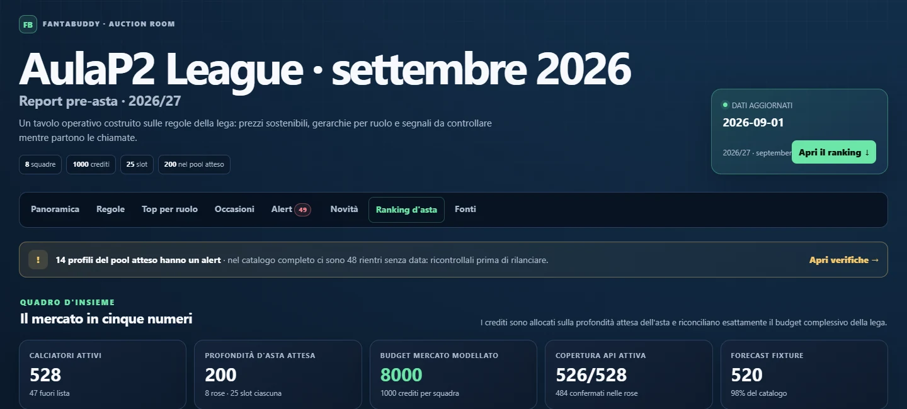
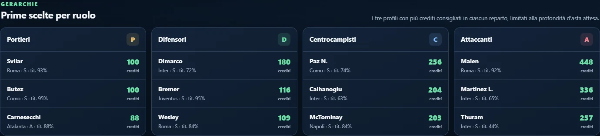
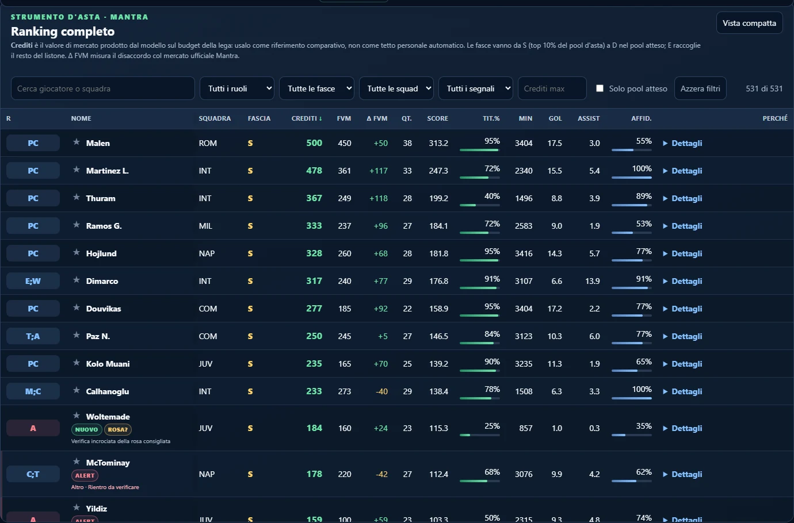
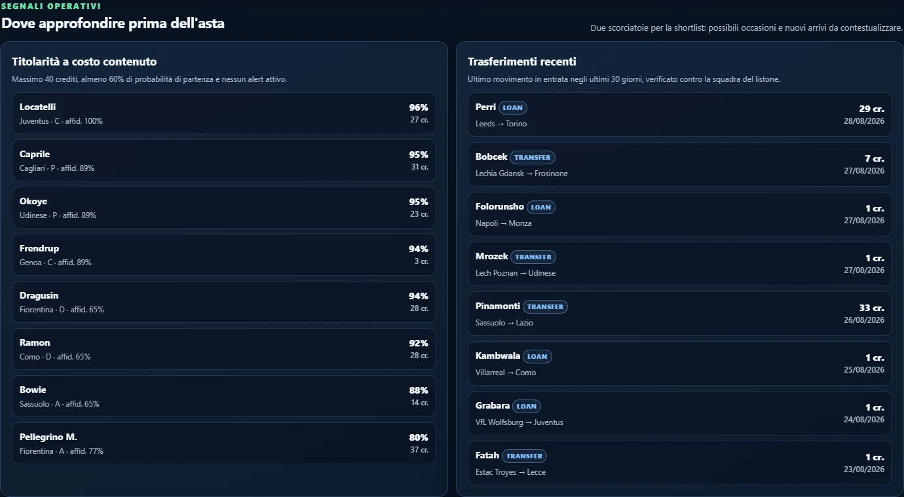

# Fantabuddy

### Il tuo storico Fantacalcio, finalmente interrogabile.

[](https://github.com/AndreaBozzo/fantabuddy/actions/workflows/ci.yml)
[](https://github.com/AndreaBozzo/fantabuddy/releases)
[](https://www.python.org/)
[](LICENSE)

Fantabuddy trasforma listoni ufficiali e dati calcistici in un warehouse DuckDB locale,
un report d'asta Classic o Mantra che funziona offline e snapshot Parquet verificabili.
Nessun account, nessun server da mantenere, nessun dato personale inviato altrove.



> Le feature passano. Lo storico resta.

## Perché esiste

Un listone fotografa un momento. Dopo pochi mesi è difficile ricordare chi ha cambiato
ruolo, quanto valeva, quando è diventato titolare o quanto fosse affidabile quel dato.
Fantabuddy conserva queste osservazioni nel tempo e prova a rispondere a domande più
utili di “chi compro?”:

- cosa è cambiato dall'ultimo snapshot;
- quali giocatori stanno guadagnando o perdendo spazio;
- quali segnali sono freschi, coperti e verificabili;
- quanto una valutazione dipende dal modello e quanto dal mercato ufficiale.

Il risultato rimane volutamente piccolo: **DuckDB + pipeline Python + report statico**.

## Cosa ottieni

### Un archivio ufficiale in un comando

I listoni Fantacalcio dal 2015/16 alla stagione corrente vengono scaricati dalle pagine
ufficiali, validati e conservati con URL e checksum. Il floor è configurabile.

```powershell
uv run fantabuddy ingest-official-listones --history-start 2015
```

### Un report da portare all'asta

Prezzi coerenti con il budget della tua lega, ranking filtrabile, delta dal report
precedente, titolarità, trasferimenti e alert disponibilità. In Mantra usa ruoli multipli,
quotazioni e FVM dedicati. È un singolo HTML: lo apri nel browser e continua a funzionare
senza rete.







### Un corpus che puoi tenere

Il warehouse cresce a ogni snapshot. I payload API restano archiviati per contenuto; il
corpus normalizzato si esporta in Parquet ordinati con manifest, schema, conteggi e
SHA-256.

```powershell
uv run fantabuddy export-corpus --snapshot-id my-corpus
uv run fantabuddy verify-corpus-export outputs/corpus/my-corpus
```

Hai ricevuto un corpus condiviso? `uv run fantabuddy import-corpus corpus.zip` crea un
nuovo warehouse locale verificato, senza chiave API. Il warehouse di destinazione non
deve già esistere; [dettagli sull'import](docs/data-and-corpus.md#import-a-shared-corpus).

## Parti in due minuti

Servono Python 3.12 e [uv](https://docs.astral.sh/uv/).

```powershell
git clone https://github.com/AndreaBozzo/fantabuddy.git
Set-Location fantabuddy
uv sync --locked
uv run fantabuddy ingest-official-listones
uv run fantabuddy corpus-status
```

Questo crea una base gratuita locale, senza chiave API. Per aggiungere statistiche,
fixture, rose, trasferimenti e indisponibilità, prosegui con la
[guida ai dati e al corpus](docs/data-and-corpus.md). Per arrivare al primo report parti
dalla [guida introduttiva](docs/getting-started.md).

## Usalo con un coding agent

Il repository è già preparato per Codex, Claude Code e Cursor. `AGENTS.md` contiene
architettura, vincoli sui dati e quality gate; `CLAUDE.md` importa la stessa guida e
Cursor legge direttamente il file root.

Apri il progetto nel tuo agente e usa questo primo prompt:

```text
Read AGENTS.md and README.md, then inspect git status and the relevant code/tests before
acting. Objective: <describe the outcome>.

Work autonomously through implementation and verification. Preserve unrelated local
changes and private data. Keep ingestion cache-first, point-in-time safe and explicit
about missing data. Update the appropriate docs when public behavior changes. Run focused
tests while iterating and the repository quality gates before handing off. End with a
short self-review: files changed, checks run, remaining data-quality limits, and anything
that still needs my decision. Do not commit, push, tag or publish unless I explicitly ask.
```

Dettagli e prompt di esempio: [workflow agentico](docs/agentic-workflow.md).

## Principi

- **Local-first.** Warehouse, cache e report restano sulla tua macchina.
- **Missing means missing.** Un valore assente non viene inventato per riempire una cella.
- **Point-in-time.** Il futuro non entra nelle feature del passato.
- **Baseline prima dell'ego.** Un modello entra nel report solo se batte una baseline
  temporale.
- **Graceful degradation.** I listoni ufficiali costruiscono una base gratuita; l'API
  aggiunge profondità quando disponibile.
- **Provenance verificabile.** URL, timestamp, raw payload e checksum accompagnano il dato.

## Limiti onesti

Il rating API non è il voto ufficiale Fantacalcio. Gli infortuni sono segnali da
verificare, non cartelle cliniche. FVM e quotazioni sono riferimenti di mercato, non il
prezzo giusto per ogni lega. I match ambigui tra provider restano in revisione invece di
essere accettati automaticamente.

La metodologia completa è in [Methodology and limits](docs/methodology.md).

## Mappa della documentazione

- [Getting started](docs/getting-started.md) — installazione, listoni, configurazione e
  primo report.
- [Data and corpus](docs/data-and-corpus.md) — API, quota, raw archive, backup ed export.
- [Methodology and limits](docs/methodology.md) — mapping, validazione e prezzi.
- [CLI reference](docs/cli-reference.md) — comandi raggruppati per workflow.
- [Agentic workflow](docs/agentic-workflow.md) — Codex, Claude Code e Cursor.
- [Contributing](CONTRIBUTING.md) · [Security](SECURITY.md) ·
  [Code of Conduct](CODE_OF_CONDUCT.md)

## La storia del progetto

Fantabuddy è nato per una lega reale e continua a crescere soprattutto nel dato, non
nella superficie dell'app. Se vuoi il racconto completo:

- [Ho costruito un modello per il Fantacalcio](https://andreabozzo.github.io/AndreaBozzo/blog/posts/fantabuddy-blog/)
- [English version](https://andreabozzo.github.io/AndreaBozzo/blog/en/posts/fantabuddy-blog/)

Domande e idee sono benvenute nelle
[GitHub Discussions](https://github.com/AndreaBozzo/fantabuddy/discussions); bug e
proposte definite nelle [issue](https://github.com/AndreaBozzo/fantabuddy/issues/new/choose).
